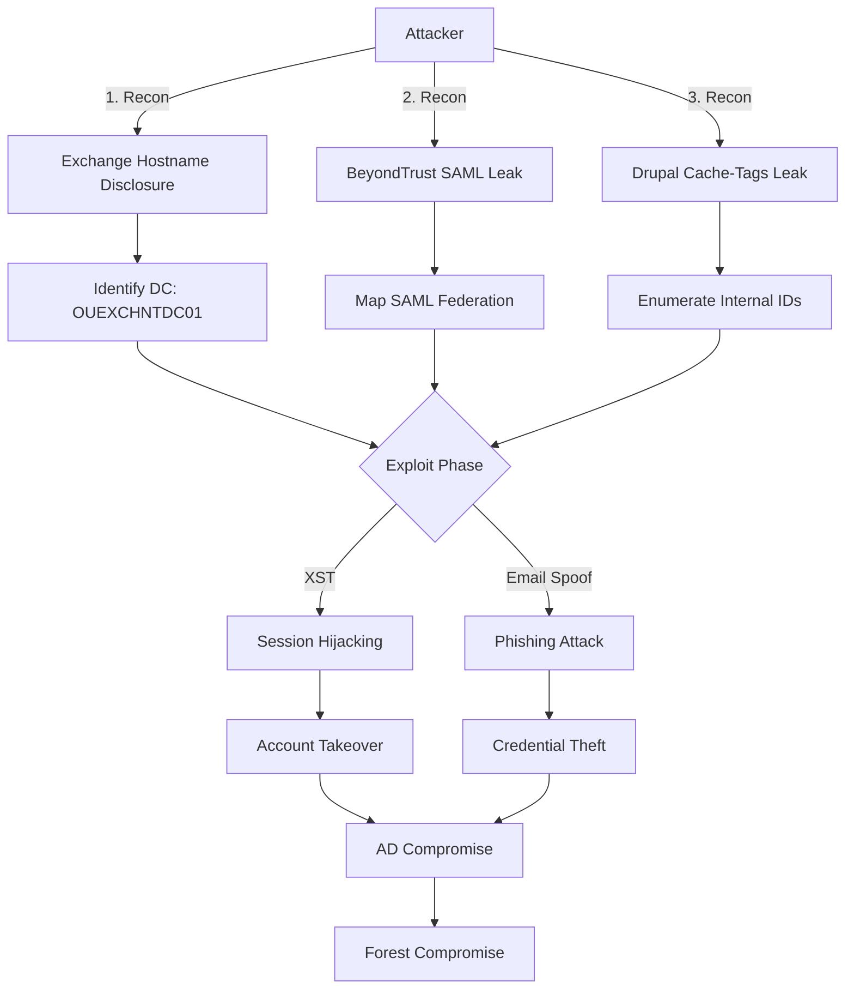
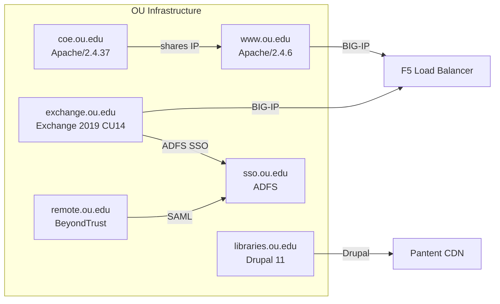
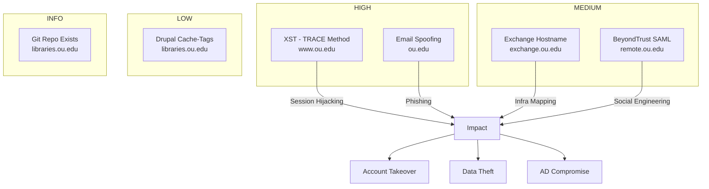

# OU.edu Red Team Hunt

A comprehensive security assessment of the University of Oklahoma's infrastructure, identifying 6 validated vulnerabilities with working proof-of-concept exploits.

## Findings

| # | Finding | Severity | Target |
|---|---------|----------|--------|
| 1 | XST (TRACE Method) | HIGH | www.ou.edu |
| 2 | Email Spoofing | HIGH | ou.edu |
| 3 | Exchange Hostname Disclosure | MEDIUM | exchange.ou.edu |
| 4 | BeyondTrust SAML Leak | MEDIUM | remote.ou.edu |
| 5 | Drupal Cache-Tags Leak | LOW | libraries.ou.edu |
| 6 | Git Repository Existence | INFO | libraries.ou.edu |

## Diagrams

### Attack Chain

### Infrastructure Map

### Findings Severity

## Interactive Diagrams

Open `DIAGRAMS.html` to view interactive Mermaid diagrams in browser.

## Quick Start

1. Open `DASHBOARD.html` for visual overview
2. Read `FINAL_COMBINED.md` for detailed findings
3. Review `ATTACK_MATRIX.md` for attack chains
4. Check `REMEDIATION_CHECKLIST.md` for fixes

## POCs

- `xst_poc.html` - Browser-based XST exploit
- `xst_poc.sh` - Bash exploit script
- `email_spoof_poc.py` - Email spoofing demonstration

## Tools Used

- T3MP3ST Arsenal (73 adapters)
- nuclei, nmap, curl, dig, nikto
- Shodan InternetDB

## License

MIT
