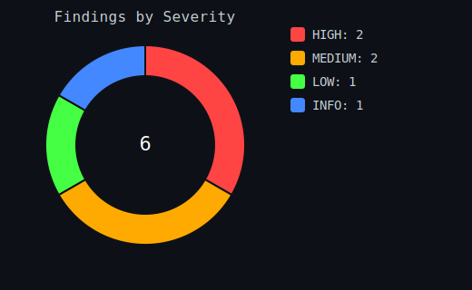
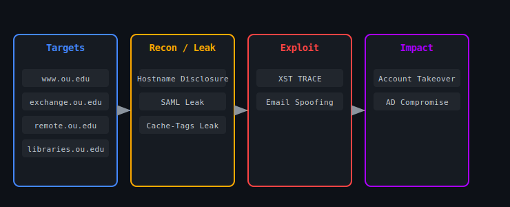
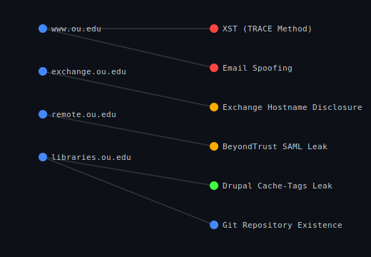
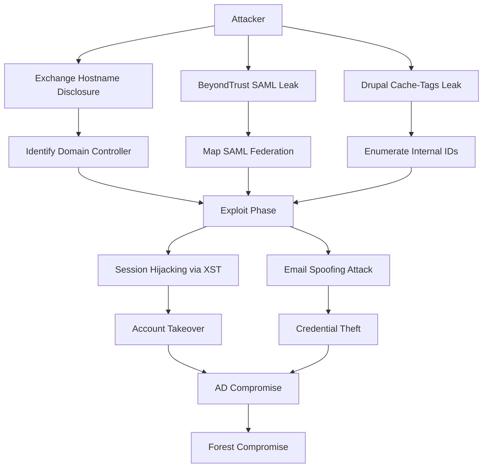
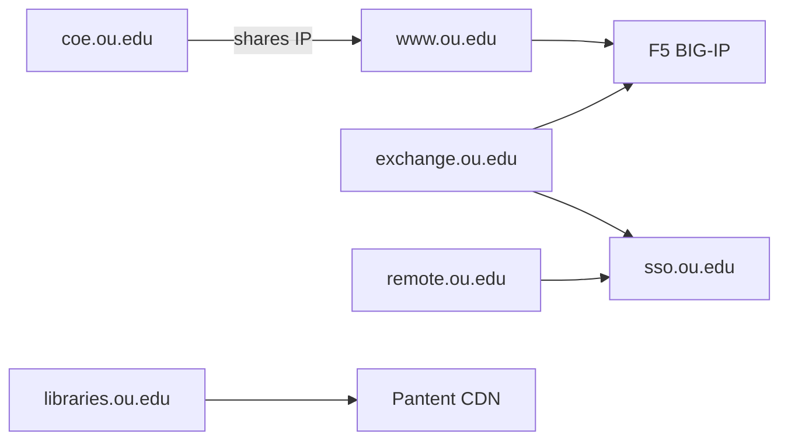
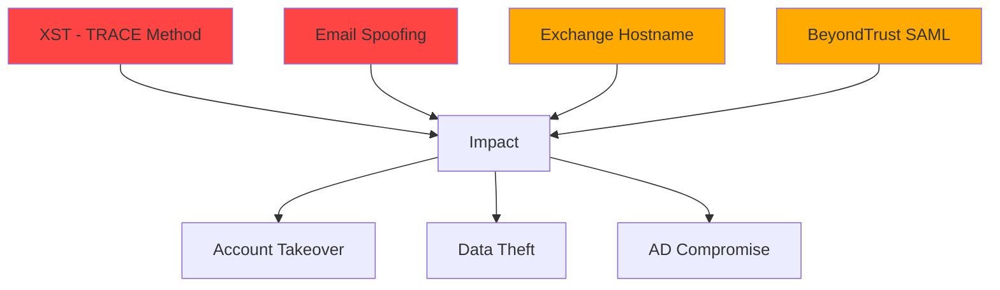

# OU.edu Red Team Hunt

A comprehensive security assessment of the University of Oklahoma's infrastructure, identifying 6 validated vulnerabilities with working proof-of-concept exploits.

## Visual Assets

Static SVGs (render on GitHub web **and** the mobile app — unlike Mermaid):

| Asset | Preview |
|-------|---------|
| Severity breakdown |  |
| Attack chain |  |
| Knowledge graph |  |

> PNG fallbacks also provided: `assets/severity.png`, `assets/attack-chain.png`, `assets/knowledge-graph.png`

## Findings

| # | Finding | Severity | Target |
|---|---------|----------|--------|
| 1 | XST (TRACE Method) | HIGH | www.ou.edu |
| 2 | Email Spoofing | HIGH | ou.edu |
| 3 | Exchange Hostname Disclosure | MEDIUM | exchange.ou.edu |
| 4 | BeyondTrust SAML Leak | MEDIUM | remote.ou.edu |
| 5 | Drupal Cache-Tags Leak | LOW | libraries.ou.edu |
| 6 | Git Repository Existence | INFO | libraries.ou.edu |

## Attack Chain

## Infrastructure Map

## Findings Severity

## Dashboard

Open `DASHBOARD.html` for an interactive visual overview of all findings.

## Knowledge Graph (Understand-Anything)

A structural knowledge graph of this repo, generated with Understand-Anything's schema (`understand/knowledge-graph.json`). Full graph in [`understand/GRAPH.md`](understand/GRAPH.md).

```mermaid
graph TD
    concept_target_www_ou_edu["www.ou.edu"]
    concept_target_ou_edu["ou.edu"]
    concept_target_exchange_ou_edu["exchange.ou.edu"]
    concept_target_remote_ou_edu["remote.ou.edu"]
    concept_target_libraries_ou_edu["libraries.ou.edu"]
    concept_target_sso_ou_edu["sso.ou.edu"]
    concept_target_coe_ou_edu["coe.ou.edu"]
    concept_finding_XST_TRACE_Method["XST (TRACE Method)"]
    concept_finding_Email_Spoofing["Email Spoofing"]
    concept_finding_Exchange_Hostname_Disclosure["Exchange Hostname Disclosure"]
    concept_finding_BeyondTrust_SAML_Leak["BeyondTrust SAML Leak"]
    concept_finding_Drupal_CacheTags_Leak["Drupal Cache-Tags Leak"]
    concept_finding_Git_Repository_Existence["Git Repository Existence"]
    document_ATTACK_MATRIX_md["ATTACK_MATRIX.md"]
    document_COMBINED_REPORT_md["COMBINED_REPORT.md"]
    document_EXECUTIVE_SUMMARY_md["EXECUTIVE_SUMMARY.md"]
    document_EXPLOIT_REPORT_md["EXPLOIT_REPORT.md"]
    document_FINAL_COMBINED_md["FINAL_COMBINED.md"]
    document_FINAL_REPORT_md["FINAL_REPORT.md"]
    document_KNOWLEDGE_GRAPH_md["KNOWLEDGE_GRAPH.md"]
    document_REMEDIATION_CHECKLIST_md["REMEDIATION_CHECKLIST.md"]
    document_REPORT_md["REPORT.md"]
    document_TEST_DIAGRAM_md["TEST_DIAGRAM.md"]
    document_ATTACK_CHAIN_mmd["ATTACK_CHAIN.mmd"]
    document_DASHBOARD_html["DASHBOARD.html"]
    document_DIAGRAMS_html["DIAGRAMS.html"]
    document_FINDINGS_SEVERITY_mmd["FINDINGS_SEVERITY.mmd"]
    document_INFRASTRUCTURE_mmd["INFRASTRUCTURE.mmd"]
    document_email_spoof_poc_py["email_spoof_poc.py"]
    document_xst_poc_html["xst_poc.html"]
    document_xst_poc_sh["xst_poc.sh"]
    concept_target_www_ou_edu -->|exposes| concept_finding_XST_TRACE_Method
    concept_target_ou_edu -->|exposes| concept_finding_Email_Spoofing
    concept_target_exchange_ou_edu -->|exposes| concept_finding_Exchange_Hostname_Disclosure
    concept_target_remote_ou_edu -->|exposes| concept_finding_BeyondTrust_SAML_Leak
    concept_target_libraries_ou_edu -->|exposes| concept_finding_Drupal_CacheTags_Leak
    concept_target_libraries_ou_edu -->|exposes| concept_finding_Git_Repository_Existence
    document_ATTACK_MATRIX_md -->|documents| concept_finding_XST_TRACE_Method
    document_ATTACK_MATRIX_md -->|documents| concept_finding_Email_Spoofing
    document_ATTACK_MATRIX_md -->|documents| concept_finding_Exchange_Hostname_Disclosure
    document_ATTACK_MATRIX_md -->|documents| concept_finding_BeyondTrust_SAML_Leak
    document_ATTACK_MATRIX_md -->|documents| concept_finding_Drupal_CacheTags_Leak
    document_ATTACK_MATRIX_md -->|documents| concept_finding_Git_Repository_Existence
    document_COMBINED_REPORT_md -->|documents| concept_finding_XST_TRACE_Method
    document_COMBINED_REPORT_md -->|documents| concept_finding_Email_Spoofing
    document_COMBINED_REPORT_md -->|documents| concept_finding_Exchange_Hostname_Disclosure
    document_COMBINED_REPORT_md -->|documents| concept_finding_BeyondTrust_SAML_Leak
    document_COMBINED_REPORT_md -->|documents| concept_finding_Drupal_CacheTags_Leak
    document_COMBINED_REPORT_md -->|documents| concept_finding_Git_Repository_Existence
    document_EXECUTIVE_SUMMARY_md -->|documents| concept_finding_XST_TRACE_Method
    document_EXECUTIVE_SUMMARY_md -->|documents| concept_finding_Email_Spoofing
    document_EXECUTIVE_SUMMARY_md -->|documents| concept_finding_Exchange_Hostname_Disclosure
    document_EXECUTIVE_SUMMARY_md -->|documents| concept_finding_BeyondTrust_SAML_Leak
    document_EXECUTIVE_SUMMARY_md -->|documents| concept_finding_Drupal_CacheTags_Leak
    document_EXECUTIVE_SUMMARY_md -->|documents| concept_finding_Git_Repository_Existence
    document_EXPLOIT_REPORT_md -->|documents| concept_finding_XST_TRACE_Method
    document_EXPLOIT_REPORT_md -->|documents| concept_finding_Email_Spoofing
    document_EXPLOIT_REPORT_md -->|documents| concept_finding_Exchange_Hostname_Disclosure
    document_EXPLOIT_REPORT_md -->|documents| concept_finding_BeyondTrust_SAML_Leak
    document_EXPLOIT_REPORT_md -->|documents| concept_finding_Drupal_CacheTags_Leak
    document_EXPLOIT_REPORT_md -->|documents| concept_finding_Git_Repository_Existence
    document_FINAL_COMBINED_md -->|documents| concept_finding_XST_TRACE_Method
    document_FINAL_COMBINED_md -->|documents| concept_finding_Email_Spoofing
    document_FINAL_COMBINED_md -->|documents| concept_finding_Exchange_Hostname_Disclosure
    document_FINAL_COMBINED_md -->|documents| concept_finding_BeyondTrust_SAML_Leak
    document_FINAL_COMBINED_md -->|documents| concept_finding_Drupal_CacheTags_Leak
    document_FINAL_COMBINED_md -->|documents| concept_finding_Git_Repository_Existence
    document_FINAL_REPORT_md -->|documents| concept_finding_XST_TRACE_Method
    document_FINAL_REPORT_md -->|documents| concept_finding_Email_Spoofing
    document_FINAL_REPORT_md -->|documents| concept_finding_Exchange_Hostname_Disclosure
    document_FINAL_REPORT_md -->|documents| concept_finding_BeyondTrust_SAML_Leak
    document_FINAL_REPORT_md -->|documents| concept_finding_Drupal_CacheTags_Leak
    document_FINAL_REPORT_md -->|documents| concept_finding_Git_Repository_Existence
    document_KNOWLEDGE_GRAPH_md -->|documents| concept_finding_XST_TRACE_Method
    document_KNOWLEDGE_GRAPH_md -->|documents| concept_finding_Email_Spoofing
    document_KNOWLEDGE_GRAPH_md -->|documents| concept_finding_Exchange_Hostname_Disclosure
    document_KNOWLEDGE_GRAPH_md -->|documents| concept_finding_BeyondTrust_SAML_Leak
    document_KNOWLEDGE_GRAPH_md -->|documents| concept_finding_Drupal_CacheTags_Leak
    document_KNOWLEDGE_GRAPH_md -->|documents| concept_finding_Git_Repository_Existence
    document_REMEDIATION_CHECKLIST_md -->|documents| concept_finding_XST_TRACE_Method
    document_REMEDIATION_CHECKLIST_md -->|documents| concept_finding_Email_Spoofing
    document_REMEDIATION_CHECKLIST_md -->|documents| concept_finding_Exchange_Hostname_Disclosure
    document_REMEDIATION_CHECKLIST_md -->|documents| concept_finding_BeyondTrust_SAML_Leak
    document_REMEDIATION_CHECKLIST_md -->|documents| concept_finding_Drupal_CacheTags_Leak
    document_REMEDIATION_CHECKLIST_md -->|documents| concept_finding_Git_Repository_Existence
    document_REPORT_md -->|documents| concept_finding_XST_TRACE_Method
    document_REPORT_md -->|documents| concept_finding_Email_Spoofing
    document_REPORT_md -->|documents| concept_finding_Exchange_Hostname_Disclosure
    document_REPORT_md -->|documents| concept_finding_BeyondTrust_SAML_Leak
    document_REPORT_md -->|documents| concept_finding_Drupal_CacheTags_Leak
    document_REPORT_md -->|documents| concept_finding_Git_Repository_Existence
    document_TEST_DIAGRAM_md -->|documents| concept_finding_XST_TRACE_Method
    document_TEST_DIAGRAM_md -->|documents| concept_finding_Email_Spoofing
    document_TEST_DIAGRAM_md -->|documents| concept_finding_Exchange_Hostname_Disclosure
    document_TEST_DIAGRAM_md -->|documents| concept_finding_BeyondTrust_SAML_Leak
    document_TEST_DIAGRAM_md -->|documents| concept_finding_Drupal_CacheTags_Leak
    document_TEST_DIAGRAM_md -->|documents| concept_finding_Git_Repository_Existence
    document_ATTACK_CHAIN_mmd -->|visualizes| concept_finding_XST_TRACE_Method
    document_ATTACK_CHAIN_mmd -->|visualizes| concept_finding_Email_Spoofing
    document_ATTACK_CHAIN_mmd -->|visualizes| concept_finding_Exchange_Hostname_Disclosure
    document_ATTACK_CHAIN_mmd -->|visualizes| concept_finding_BeyondTrust_SAML_Leak
    document_ATTACK_CHAIN_mmd -->|visualizes| concept_finding_Drupal_CacheTags_Leak
    document_ATTACK_CHAIN_mmd -->|visualizes| concept_finding_Git_Repository_Existence
    document_DASHBOARD_html -->|visualizes| concept_finding_XST_TRACE_Method
    document_DASHBOARD_html -->|visualizes| concept_finding_Email_Spoofing
    document_DASHBOARD_html -->|visualizes| concept_finding_Exchange_Hostname_Disclosure
    document_DASHBOARD_html -->|visualizes| concept_finding_BeyondTrust_SAML_Leak
    document_DASHBOARD_html -->|visualizes| concept_finding_Drupal_CacheTags_Leak
    document_DASHBOARD_html -->|visualizes| concept_finding_Git_Repository_Existence
    document_DIAGRAMS_html -->|visualizes| concept_finding_XST_TRACE_Method
    document_DIAGRAMS_html -->|visualizes| concept_finding_Email_Spoofing
    document_DIAGRAMS_html -->|visualizes| concept_finding_Exchange_Hostname_Disclosure
    document_DIAGRAMS_html -->|visualizes| concept_finding_BeyondTrust_SAML_Leak
    document_DIAGRAMS_html -->|visualizes| concept_finding_Drupal_CacheTags_Leak
    document_DIAGRAMS_html -->|visualizes| concept_finding_Git_Repository_Existence
    document_FINDINGS_SEVERITY_mmd -->|visualizes| concept_finding_XST_TRACE_Method
    document_FINDINGS_SEVERITY_mmd -->|visualizes| concept_finding_Email_Spoofing
    document_FINDINGS_SEVERITY_mmd -->|visualizes| concept_finding_Exchange_Hostname_Disclosure
    document_FINDINGS_SEVERITY_mmd -->|visualizes| concept_finding_BeyondTrust_SAML_Leak
    document_FINDINGS_SEVERITY_mmd -->|visualizes| concept_finding_Drupal_CacheTags_Leak
    document_FINDINGS_SEVERITY_mmd -->|visualizes| concept_finding_Git_Repository_Existence
    document_INFRASTRUCTURE_mmd -->|visualizes| concept_finding_XST_TRACE_Method
    document_INFRASTRUCTURE_mmd -->|visualizes| concept_finding_Email_Spoofing
    document_INFRASTRUCTURE_mmd -->|visualizes| concept_finding_Exchange_Hostname_Disclosure
    document_INFRASTRUCTURE_mmd -->|visualizes| concept_finding_BeyondTrust_SAML_Leak
    document_INFRASTRUCTURE_mmd -->|visualizes| concept_finding_Drupal_CacheTags_Leak
    document_INFRASTRUCTURE_mmd -->|visualizes| concept_finding_Git_Repository_Existence
    document_email_spoof_poc_py -->|exploits| concept_finding_Email_Spoofing
    document_xst_poc_html -->|exploits| concept_finding_XST_TRACE_Method
    document_xst_poc_sh -->|exploits| concept_finding_XST_TRACE_Method
    style document_ATTACK_MATRIX_md fill:#888888,color:#fff
    style document_COMBINED_REPORT_md fill:#888888,color:#fff
    style document_EXECUTIVE_SUMMARY_md fill:#888888,color:#fff
    style document_EXPLOIT_REPORT_md fill:#888888,color:#fff
    style document_FINAL_COMBINED_md fill:#888888,color:#fff
    style document_FINAL_REPORT_md fill:#888888,color:#fff
    style document_KNOWLEDGE_GRAPH_md fill:#888888,color:#fff
    style document_REMEDIATION_CHECKLIST_md fill:#888888,color:#fff
    style document_REPORT_md fill:#888888,color:#fff
    style document_TEST_DIAGRAM_md fill:#888888,color:#fff
    style document_ATTACK_CHAIN_mmd fill:#888888,color:#fff
    style document_DASHBOARD_html fill:#888888,color:#fff
    style document_DIAGRAMS_html fill:#888888,color:#fff
    style document_FINDINGS_SEVERITY_mmd fill:#888888,color:#fff
    style document_INFRASTRUCTURE_mmd fill:#888888,color:#fff
    style document_email_spoof_poc_py fill:#888888,color:#fff
    style document_xst_poc_html fill:#888888,color:#fff
    style document_xst_poc_sh fill:#888888,color:#fff
```

## Diagrams

Open `DIAGRAMS.html` to view interactive Mermaid diagrams in your browser.

### Mermaid Source Files

| File | Description |
|------|-------------|
| `ATTACK_CHAIN.mmd` | Attack chain flow |
| `INFRASTRUCTURE.mmd` | Infrastructure map |
| `FINDINGS_SEVERITY.mmd` | Severity breakdown |

## POCs

| File | Description |
|------|-------------|
| `xst_poc.html` | Browser-based XST exploit |
| `xst_poc.sh` | Bash exploit script |
| `email_spoof_poc.py` | Email spoofing demonstration |
| `beyondtrust_poc.md` | BeyondTrust findings |

## Reports

| File | Description |
|------|-------------|
| `FINAL_COMBINED.md` | Complete findings report |
| `EXECUTIVE_SUMMARY.md` | High-level summary |
| `ATTACK_MATRIX.md` | Attack techniques and kill chain |
| `REMEDIATION_CHECKLIST.md` | Actionable fix checklist |
| `KNOWLEDGE_GRAPH.md` | Interactive knowledge graph |

## Tools Used

- T3MP3ST Arsenal (73 adapters)
- nuclei, nmap, curl, dig, nikto
- Shodan InternetDB

## License

MIT
